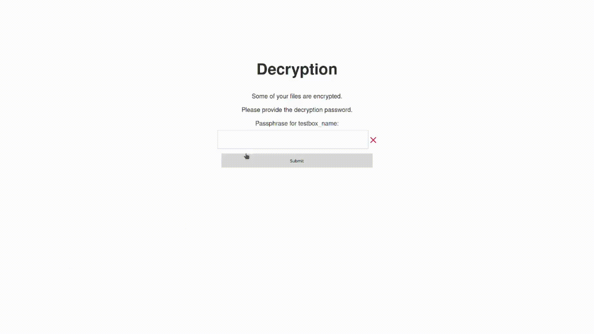

# 🔒 luks-web

A simple Web-UI to unlock your LUKS devices when you boot your computer.



## 🔧 How to Install

#### Requirements

Requirements are in `requirements.txt`. These must be installed **as root** (or with sudo), as you'll need root access to run this program because it needs access to the device mapper and mounting capabilities.

### 🧰 Systemd (Recommended)

- Clone the repo and install requirements:

  ```bash
  cd /opt
  sudo git clone https://github.com/peprolinbot/luks-web.git
  cd luks-web
  sudo pip3 install -r requirements.txt
  ```

- Create the file `/etc/systemd/system/luks-web.service` and edit if neccesary:

  ```bash
  sudo cp luks-web.service /etc/systemd/system/
  sudo nano /etc/systemd/system/luks-web.service
  ```

- Create the config file at `/etc/luks-web/settings.yaml` ([instructions below](#-settings-file)), create parent dir if neccesary.

  ```bash
  sudo mkdir /etc/luks-web/
  sudo cp settings.yaml.example /etc/luks-web/settings.yaml
  sudo nano /etc/luks-web/settings.yaml
  ```

- Make the service start on boot:

  ```bash
  sudo systemctl enable luks-web
  ```

- _**IMPORTANT**_: [Secure the installation](#-security)

### 💪🏻 Manual

These are the commands to run this thing. You can handle the execution with whatever you want.

```bash
git clone https://github.com/peprolinbot/luks-web.git
cd luks-web
sudo pip3 install -r requirements.txt
sudo python3 main.py # For development
# OR
sudo gunicorn main:app -b 0.0.0.0:8000 # For production
```

#### 🛡 Security

It's not a good a idea to enter your passwords in a non-https website, someone could easily make a MITM attack while you are entering them. You should put this app behind a reverse proxy with SSL or something. Search for some tutorials online.

#### ⚙️ Environment Variables

| Name                         | Description |
|------------------------------|-------------|
| `LW_SETTINGS_FILE`   | Path of the settings file. _(Default: "settings.yaml")_
| `LW_STOP_CMD` | Command to run to stop the server. _(Overrides value  in settings.yaml)_

#### 📝 Settings file

These are the contents of `settings.yaml.example`:

```yaml
# All of the values here must be set. They are NOT optional
devices: # List of devices to decrypt
  data: # Name to show in the web and use with the API
    name: data_crypt # Name to use for the mapper
    path: /dev/sda3 # Path or device where the LUKS device is located
    mount: /data # Where to mount the decrypted device

  media:
    name: media_crypt
    path: /dev/sdb1
    mount: /media

stop_cmd: systemctl stop luks-web # This value can be overwritten by the LW_STOP_CMD env var.
```

## ⚡ API Docs

_**Note:**_ The id of a device is the name used to define it in the settings. In the example configuration file above the device ids would be _data_ and _media_.

- GET, POST - _/unlock/**device_id**?key=**device_password**_ - Unlocks the specified device. The password can also be passed as form data with name _**device\_id**\_password_
  - Output:
  ```json
  {"status": "succesful", #Or "error"
  "cryptsetup_exit_code": <cryptsetup_exit_code>,
  "cryptsetup_output": <cryptsetup_output>,
  "mount_exit_code": <mount_exit_code>,
  "mount_output": <mount_output>}
  ```
- GET - _/check_unlocked/**device_id**_ - Checks if the specified device is unlocked
  - Output:
  ```json
  {"status": "unlocked"} #Or "locked"
  ```

- GET, POST - _/kill_ - Kills the server. Only runs when all devices are decrypted.
  - Output:
  ```json
  {"exit_code": <exit_code_of_the_stop_command>}
  #OR
  {"message": "You can't do that until you unlock all the devices"}
  ```

## ❤️ Credits

- Lock favicon - [Pixabay](https://pixabay.com/vectors/padlock-locked-brass-grey-lock-148850/)

- Idea and part of the html template - [pwnagotchi](https://github.com/evilsocket/pwnagotchi/blob/master/builder/data/usr/bin/decryption-webserver)
